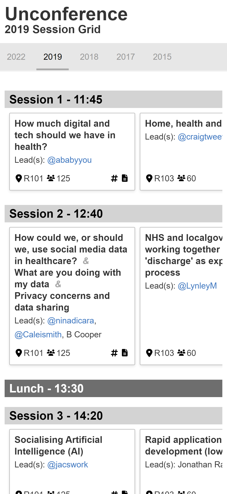
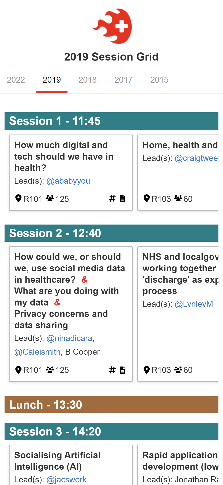
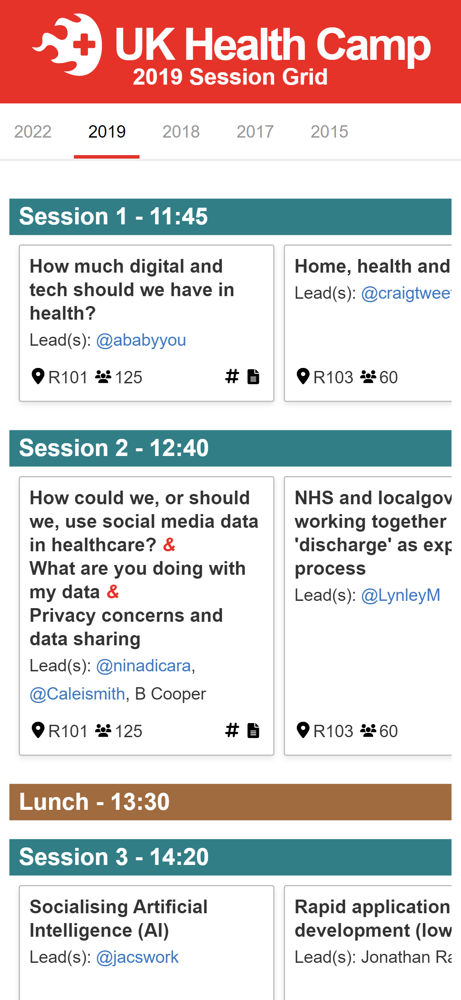

# Unconference Sessions

This is a TypeScript [Svelte](https://svelte.dev/) app (bundled by [Vite](https://vitejs.dev/)) to produce an easy to browse live "Session Grid" (schedule) for Unconferences based off a Google Spreadsheet. It was built for and is used by [UK Health Camp](https://ukhealthcamp.com/). It is heavily inspired by [unconf-live-session-grid](https://github.com/ConvivioTeam/unconf-live-session-grid) made by [Convivio](https://blog.weareconvivio.com/a-mobile-schedule-for-unconferences-cf78d73483b5).

**Example Session Grid**: https://ukhealthcamp.com/session-grid/  
**Source Spreadsheet**: https://docs.google.com/spreadsheets/d/1oIRrU1rWakVxObhuYJhFNwe_BuKnkAtd1R_olz_Q040/

## Quick Start

1. Copy the 3 files found in `dist` to a publicly accessible folder on a webserver.
2. Edit the configuration settings in `index.html` by modifying the css in `<style>` and the variables in `<script>` to set:
    - The Unconference name
    - Configure the branding / logo / custom colours
    - Set the spreadsheet URL or `csv` source
    - Modify the auto-refresh time (milliseconds)

    ```html
    <style>
      :root {
        --years:#e7e7e7;                /* BG colour of year navigation */
        --accent:#a9a9a9;               /* Accent colour of year navigation */
        --titles:#d3d3d3;               /* BG colour session heading */
        --titles-color:#000000;         /* Font colour of session heading */
        --titles-timing:#6e6e6e;        /* BG colour timing only session heading */
        --titles-timing-color:#ffffff;  /* Font colour of timing only session heading */
      }
      @media (prefers-color-scheme: dark) {
        :root {                         /* Colours used when in dark-mode */
          --years: #292a2d;
          --accent: #eff1f2;
          --titles: #292a2d;
          --titles-color: #eff1f2;
          --titles-timing: #6e6e6e80;
          --titles-timing-color: #eff1f2;
          --icon-color: #9aa0a6;
        }
      }
    </style>
    <script>
      document.App = {
        name: 'Unconference Name',
        branding: {
          logo: '/logo.png',
          subheading: false,
          center: true
        },
        sessionData: 'https://docs.google.com/<spreasheet-url>/export?format=csv',
        // sessionData: './data.csv',
        refreshTime: 15000 // In milliseconds (set to 0 to disable)
      }
    </script>
    ```

## Screenshots

### Mobile

<table style="table-layout:fixed;width:100%">
  <tr>
    <th style="text-align:center">Unbranded</th>
    <th style="text-align:center">Simple Branding</th>
    <th style="text-align:center">UK Health Camp</th>
  </tr>
  <tr>
    <td style="text-align:center"></td>
    <td style="text-align:center"></td>
    <td style="text-align:center"></td>
  </tr>
</table>

## Details

The built Svelte app is a SPA and consists of a 3 files that can be found in `dist` these can be used as is and configured as above. By default a session grid for the current year will be created with a "No Session Data" message if no sessions are present. Grids will be created for all other years in the source data.

### Spreadsheet / `csv` Format

Due to the heritage of `unconference-sessions` it expects a `csv`/spreadsheet in the [UKGovcamp](https://www.ukgovcamp.com/) style - specifically the structure now used by [UK Health Camp](https://ukhealthcamp.com/) in their [session spreadsheet](https://docs.google.com/spreadsheets/d/1oIRrU1rWakVxObhuYJhFNwe_BuKnkAtd1R_olz_Q040/). 

To be specific `unconference-sessions` expects a `csv` with the following heading/column order: `['year', 'time', 'session', 'room', 'capacity', 'title', 'leader1', 'leader2', 'leader3', 'leader4', 'notesUrl', 'hashtag']`

#### Google Spreadsheet

It isn't [documented](https://developers.google.com/sheets/api) but Google Spreadsheets provide a `csv` export (link accessible from `File > Download > Comma-separated values`) that has permissive [CORS](https://developer.mozilla.org/en-US/docs/Web/HTTP/CORS) the enables the 'live' functionality of `unconference-sessions` to work without the need for API Keys or complex proxies. 

**Note:** _Clearly as this permissive CORS is undocumented it may be changed at any time by Google. Particularly if they feel it is being abused. So I would recommend using a `csv` file hosted on your own webserver or a caching proxy etc. if you expect high volumes of traffic._

### Auto-refresh / 'Live' Functionality

A 'live' auto-refresh functionality defaulting to 15seconds is active only on the session grid for the current year. It will be disabled if there are no sessions in the `csv`/spreadsheet for the current year. It will attempt to use the [Page Visibility API](https://developer.mozilla.org/en-US/docs/Web/API/Page_Visibility_API) to pause refreshes when the webpage is hidden. It can also be manually paused by clicking the "countdown circle" to the right of the year navigation links.

## Development

NodeJS 14.18+ or 16+ is required. Clone the repository and run `npm install` and use `npm run dev` and `npm run build` as needed.

Default settings for [VS Code](https://code.visualstudio.com/) and the [Svelte](https://marketplace.visualstudio.com/items?itemName=svelte.svelte-vscode) and [ESLint](https://marketplace.visualstudio.com/items?itemName=dbaeumer.vscode-eslint) extensions are included in `.vscode` as is configuration for a container based development environment using [VSCode Remote - Containers](https://code.visualstudio.com/docs/remote/containers) in `.devcontainer`

## Licence

`unconference-sessions` is published under the [Apache License 2.0](LICENSE) licence